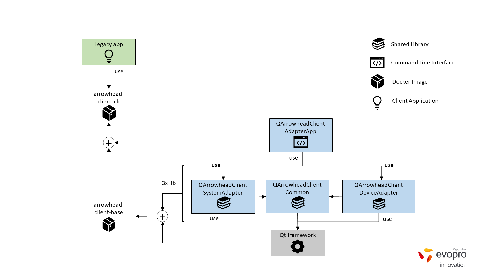
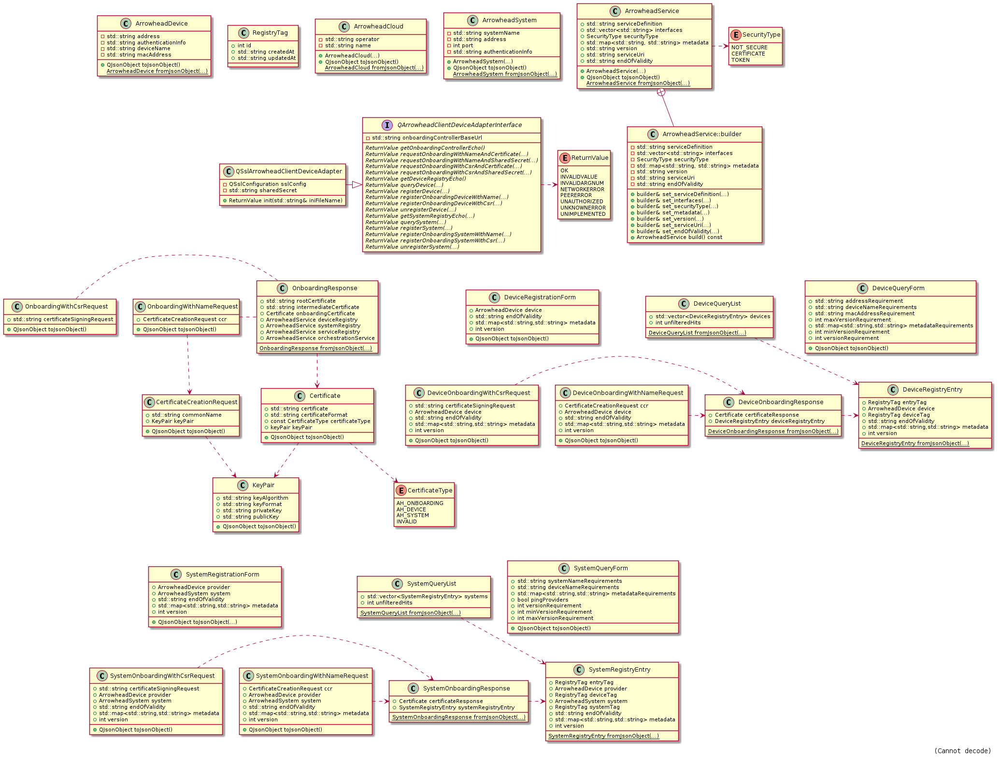

# client-adapter-qt

## Overview
The _client-adapter-qt_ software package enables application developers and system integrators to create distributed IIoT solutions in compliance with the Arrowhead framework specification by delivering client-side implementation of the standard Arrowhead core services (version 4.1.3). _client-adapter-qt_ makes use of Qt/C++ technology. It is released both as a set of static software libraries for application developers and as executable configuration tool for system integrators. 

Figure 1 illustrates how software developers and system integrators can use _client-adapter-qt_ software to integrate their applications with the Arrowhead framework.


*Figure 1 - Target users of _client-adapter-qt_*

The low-level software libraries are extended with _REST_ and _DBus_ interfaces and packaged together with their dependencies in order to form docker images, thus enabling easy deployment without any coding efforts. This structure is depicted in Figure 2. 


*Figure 2 - _client-adapter-qt_ structure*

The docker images can be downloaded to docker-enabled edge computers in order to perform Arrowhead-integration of legacy applications of various kinds (like e.g. CAN-filtering, sensor drivers etc.). Figure 3 illustrates such a deployment scenario.


*Figure 3 - _client-adapter-qt_ with docker infrastructure*

## Repository structure
- [client-adapter-qt](#documentation)
  - [client-common-lib-qt](#client-common-lib-qt) 
    - [QArrowheadClientCommon](#qarrowheadclientcommon) 
    - [TEST_QArrowheadClientCommon](#test_qarrowheadclientcommon) 
  - [client-system-adapter-lib-qt](#client-system-adapter-lib-qt)
    - [QArrowheadClientSystemAdapter](#qarrowheadclientsystemadapter)
    - [TEST_QArrowheadClientSystemAdapter](#test_qarrowheadclientsystemadapter)
  - client-device-adapter-lib-qt
    - QArrowheadClientDeviceAdapter
    - TEST_QArrowheadClientDeviceAdapter
  - client-adapter-app-qt
    - QArrowheadClientAdapterApp
    - TEST_QArrowheadClientAdapterApp

## Contribution
Questions, comments, proposals related to _client-adapter-qt_ are always welcome. Please send an email to balint.peceli at eilabs dot com or open a pull request with your modifications.

## License
_client-adapter-qt_ is licensed under the [Eclipse Public License 2.0](https://www.eclipse.org/legal/epl-2.0/).

## Documentation
# client-common-lib-qt
## QArrowheadClientCommon
_QArrowheadClientCommon_ is a base library containing the definitions of Arrowhead data types like _ArrowheadCloud_, _ArrowheadSystem_ and _ArrowheadService_.

### Data Types
The Class Diagram of the library is presented in Figure 4:


*Figure 4 -QArrowheadClientCommon Class Diagram*

## Target directory
The compiled library will be deployed to the target directory defined in the [project file](./client-common-lib-qt/QArrowheadClientCommon/QArrowheadClientCommon.pro) by the _target.path_ variable.

## TEST_QArrowheadClientCommon
_TEST_QArrowheadClientCommon_ is a Qt Test application implementing unit tests for _QArrowheadClientCommon_.

# client-system-adapter-lib-qt
## QArrowheadClientSystemAdapter

## Prerequisites
The reader is required to have a good understanding of the Arrowhead framework before using _QArrowheadClientSystemAdapter_. Please consult the [Arrowhead core repository](https://github.com/arrowhead-f/core-java-spring/blob/master/README.md) for detailed documentation with special focus on the [_Service Registry_](https://github.com/arrowhead-f/core-java-spring/blob/master/README.md#serviceregistry), [_Authorization_](https://github.com/arrowhead-f/core-java-spring/blob/master/README.md#authorization) and [_Orchestrator_](https://github.com/arrowhead-f/core-java-spring/blob/master/README.md#orchestrator) core systems and their public client services.

## Specification
- Qt/C++ software library
  - Qt version: 5.12 LTS
  - Compiled and released as static library
- Implements Arrowhead client functionalities
  - Client-side implementation of mandatory core services
  - Supported Arrowhead version: 4.1.3
- Service Registry interface
  - echo
  - register
  - unregister
  - query
- Authorization interface
  - echo
  - get public key
- Orchestrator interface
  - echo
  - request orchestration
  - start store orchestration by id
- Target users:
  - software developers responsible for creating Arrowhead-compliant application systems and services

## Initialization
The library must be initialized by instantiating a _QArrowheadHttpClientSystemAdapter_ class.

The constructor requires the the following parameters:
* `std::string serviceRegistryBaseUrl` - the base URL of the Service Registry core system,
* `std::string authorizationBaseUrl` - the base URL of the Authorization core system,
* `std::string orchestratorBaseUrl` - the base URL of the Orchestrator core system,
* `std::unique_ptr\<ArrowheadSystem\> clientSystem` - the specification of the client system, which will be adapted to the Arrowhead local cloud.

In addition, SSL configuration should be set by calling the _setSslConfig_ method of the previously instantiated _QArrowheadHttpClientSystemAdapter_ class, with the proper parameters:
* `std::string keyStoreFileName` - the name (absolute path) of the pkcs12 formatted keystore file,
* `std::string keyStorePwd` - password to the keystore,
* `bool disableHostNameVerification` - flag indicating the need for client-side host name verification (optional, only for testing).

### Notes
> See [arrowhead.ini](./client-system-adapter-lib-qt/TEST_QArrowheadClientSystemAdapter/etc/arrowhead.ini) for an example configuration file


> The presented client certificate shall be signed by the local cloud certificate's private key. See the [Arrowhead core documentation](https://github.com/arrowhead-f/core-java-spring/blob/master/README.md#certificates) for certificate generation guide. 


## Interface description
The interface class _QArrowheadClientSystemAdapter_ has the following public functions:
- [echoServiceRegistry](#echoServiceRegistry)
- [queryService](#queryservice)
- [registerService](#registerservice)
- [unregisterService](#unregisterservice)
- [echoAuthorizationSystem](#echoAuthoziationSystem)
- [getPublicKey](#getPublicKey)
- [echoOrchestrator](#echoOrchestrator)
- [requestOrchestration](#requestOrchestration)
- [requestOrchestrationById](#requestOrchestrationById)

The library performs blocking network calls. Each interface funtion returns a _ReturnValue_ (defined in [QArrowheadClientCommon](#qarrowheadclientcommon)), which should be interpreted as follows:

|Return value     |Condition|
|:----------------|:--------|
|ReturnValue::Ok  |Peer returned with the expected reply message. See the [Arrowhead core documentation](https://github.com/arrowhead-f/core-java-spring) for the service definitions.|
|ReturnValue::InvalidValue  |Invalid input arguments provided|
|ReturnValue::UnknownError     |Network or peer error detected|
|ReturnValue::Unimplemented   |Requested operation is not implemented|

## echoServiceRegistry
---
### Signature
```cpp
ReturnValue echoServiceRegistry();
```

### Description
The _echoServiceRegistry_ function tests connection to the Service Registry by using its _Echo_ interface.

## queryService
---
### Signature
```cpp
ReturnValue queryService(const ServiceQueryForm& serviceQueryForm, std::unique_ptr<ServiceQueryList>& uptr_ServiceQueryList);
```

### Description
The _queryService_ function queries the Service Registry for the presence of the indicated service.

### Notes
> Direct lookups from Application Systems within the network is not advised in [Arrowhead generation 4.1.3](https://github.com/arrowhead-f/core-java-spring/tree/development#service-registry), due to security reasons.

> The _id_, _createdAt_ and _updatedAt_ fields of the response are ignored since they are not relevant for the client. The client should consult the HTTP status code in order to check the effect of its request.


## registerService
---
### Signature
```cpp
ReturnValue registerService(const ServiceRegistrationForm& serviceRegistrationForm, std::unique_ptr<ServiceRegistryEntry>& uptr_ServiceRegistryEntry);
```

### Description
The _registerService_ function registers an application service to the Service Registry.


## unregisterService
---
### Signature
```cpp
ReturnValue unregisterService(const ServiceRegistryEntry& serviceRegistryEntry);
```

### Description
The _unregisterService_ function deregisters from the Service Registry the application service defined by the _ServiceRegistryEntry_ input argument.


## echoAuthoziationSystem
---
### Signature
```cpp
ReturnValue echoAuthorizationSystem();
```

### Description
The _echoAuthorizationSystem_ function tests connection to the Authorization System by using its _Echo_ interface.

## getPublicKey
---
### Signature
```cpp
ReturnValue getPublicKey(const std::string& publicKey);
```

### Description
The _getPublicKey_ function returns the public key of the Authorization System as a base64 encoded string.

### Notes
> Only applicable with SSL enabled.


## echoOrchestrator
---
### Signature
```cpp
ReturnValue echoOrchestrator();
```

### Description
The _echoOrchestrator_ function tests connection to the Orchestrator by using its _Echo_ interface.

## requestOrchestration
---
### Signature
```cpp
ReturnValue requestOrchestration(const ServiceRequestForm& serviceRequestForm, std::unique_ptr<OrchestrationResponse>& uptr_orchestrationResponse);
```

### Description
The _requestOrchestration_ function requests service orchestration from the Orchestrator.

### Notes
> The default orchestration-method is store-based orchestration. Dynamic orchestration request shall be specified by setting the _overrideStore_ orchestration flag in the _ServiceRequestForm_. See the [Arrowhead core documentation](https://github.com/arrowhead-f/core-java-spring#dynamic-orchestration-1) for further details.


## requestOrchestrationById
---
### Signature
```cpp
ReturnValue requestOrchestrationById(const int storeEntryId, std::unique_ptr<OrchestrationResponse>& uptr_orchestrationResponse);
```

### Description
The _requestOrchestrationById_ function requests service orchestration from the Orchestrator using the store entry id of the requester system.

## Data Types
The data classes implemented by the library are specified by the requested Arrowhead core services. The definition of the input forms and output responses can be found in the [Arrowhead core documentation](https://github.com/arrowhead-f/core-java-spring#documentation).
The Class Diagram of the library is presented in Figure 5:


*Figure 5 - QArrowheadClientSystemAdapter Class Diagram*

## Target directory
The compiled library will be deployed to the target directory defined in the [project file](./client-system-adapter-lib-qt/QArrowheadClientSystemAdapter/QArrowheadClientSystemAdapter.pro) by the _target.path_ variable.

## TEST_QArrowheadClientSystemAdapter
_TEST_QArrowheadClientSystemAdapter_ is a Qt Test application implementing unit tests for _QArrowheadClientSystemAdapter_. For the unit tests to pass, the following Arrowhead core systems are required to be available: _Service Registry_, _Authorization_, _Orchestrator_. The core service endpoints and the parameters of the adapted client system and services must be defined in the [arrowhead.ini](./client-system-adapter-lib-qt/TEST_QArrowheadClientSystemAdapter/etc/arrowhead.ini) configuration file. 

# QArrowheadClientDeviceAdapter
## Prerequisites
The reader is required to have a good understanding of the Arrowhead framework before using QArrowheadClientDeviceAdapter. Please consult the [Arrowhead core repository](https://github.com/arrowhead-f/core-java-spring/tree/development/README.md) for detailed documentation with special focus on the [_Onboarding Controller_](https://github.com/arrowhead-f/core-java-spring/tree/development#onboardingcontroller), [_Device Registry_](https://github.com/arrowhead-f/core-java-spring/tree/development#deviceregistry) and [_System Registry_](https://github.com/arrowhead-f/core-java-spring/tree/development#systemregistry) core systems and their public client services.

## Specification
- Qt/C++ software library
  - Qt version: 5.12 LTS
  - Compiled and released
- Implements Arrowhead onboarding client functionalities
  - Client-side implementation of onboarding core services
  - Supported Arrowhead version: 4.1.3
- System Registry interface
  - register
  - unregister
  - query
- Device Registry interface
  - register
  - unregister
  - query
- Onboarding interface
  - Onboarding with certificate and name
  - Onboarding with certificate and csr
  - Onboarding with shared secret and name
  - Onboarding with shared secret and csr
- Target users:
  - software developers responsible for creating Arrowhead-compliant application systems and services

## Arrowhead Onboarding Procedure
"The onboarding procedure is needed when a new device produced by any vendor (e.g. Siemens, Infineon, Bosch, etc.), containing a security controller (e.g. TPM), wants to interact with the Arrowhead local cloud. To assure that the cloud is not compromised upon the arrival of this new device, it is important to establish a chain of trust from the new hardware device, to its hosted application systems and their services. Thus, the onboarding procedure makes possible that the device, systems and services are authenticated and authorized to connect to the Arrowhead local cloud." (from the [Arrowhead core documentation](https://github.com/arrowhead-f/core-java-spring/tree/development#onboardingcontroller))

1.	The previously unknown client requests onboarding from the Onboarding Controller .
    - A) The client can present a shared secret, which is defined in the application.properties file of the Onboarding Controller.
    - B) Alternatively, the client can present a certificate, which must be a preloaded Arrowhead certificate (i.e. it is signed by the local cloud certificate), but at this point no other restrictions apply (e.g. against the common name). 
    - C) Accepting manufacturer certificates – coming soon.

2.	The Onboarding Controller responds with an onboarding certificate and the correct endpoints for the device registry, system registry, service registry and orchestrator. For example if the client provided a CSR in step 1), it will get the endpoint for the "onboarding with CSR" on device and system registry.

3.	The client registers its device into the Device Registry 
    - A) The client must use the onboarding endpoint and present the onboarding certificate.
    - B) In the request body the “deviceName” must match the first part of the target (i.e. requested) “commonName” (like “deviceName”=”myRaspberryPi”, target “commonName”=”myRaspberryPi.testCloud2.aitia.arrowhead.eu”).
    - C)	In the request body “publicKey” and “authenticationInfo” must be the same.

4.	The Device Registry responds with the device certificate.

5.	The device registers its systems to the System Registry 
    - A)	The device must use the onboarding endpoint and present the device certificate.
    - B)	In the request body the “systemName” must match the first part of the target (i.e. requested) “commonName”. (like “systemName”=”myDataGateway”, “commonName”=”myDataGateway.testCloud2.aitia.arrowhead.eu”)
    - C) In the request body “publicKey” and “authenticationInfo” must be the same.

6.	The procedure ends with the registration in system registry. 
The returned system certificate is arrowhead compliant.
If a service is registrered in the service registry, the service registry will already verify that the first part of the commonName matches the "provider" systemName in the payload.

> Remarks:
> - 1B), 1C) is actually the same step. In both cases the certificate authority verifies the certificates (invoked by onboarding controller). _Currently_ the onboarding controller tries to verify the certificate itself and will let almost everything through.
> - 1\) There is a clear separation between authentication (1A or 1B) and method of onboarding. 
Either the client lets the onboarding controller create a certificate signing request (CSR) or the client needs to provide a CSR.
> - 3\) If the onboarding controller generates the CSR, then the resulting certificate will have an additional part in the commonName denominating the certificate type: "\<XXX>.onboarding.testCloud2.aitia.arrowhead.eu".
Such a certificate will not be arrowhead compliant and only be accepted during the onboarding procedure by the device registry. 
This will be even reflected in future through the validity date of the certificate. In future, the onboarding and device certificates will have a very short validity.
> - 5\) This time the result certificate is arrowhead compliant and accepted everywhere. “systemName”=”myDataGateway”, “commonName”=”myDataGateway.testCloud2.aitia.arrowhead.eu”
>- 	The regular register methods of the Device and System Registries can be used by the clients/devices if they possess the required onboarding/device cert already, but they don’t need any new cert in the response.
>    - With the onboarding certificate, the client may unregister its device. 
It can not register its device because it would not be able to contact the next system. For registering its device, it needs a device certificate (or an arrowhead compliant certificate).
>    - Similarly, with the device certificate, the client may unregister its system. 
It can not register its system because it would not be able to contact the next system. For registering its system, it needs a (arrowhead compliant) system certificate.
>-	The certificates used in the procedure are “client certificates” according to the definition given here: https://github.com/arrowhead-f/core-java-spring/tree/development#certificates
>    - Exception: If the onboarding controller or device registry creates the CSR on behalf of the client, the resulting certificate will not be compliant with that definition. 
The idea behind this is that such a certificate is only valid for onboarding and is not to be trusted by any other system in arrowhead. 


## Initialization
TBD

> Note: At the time only a preloaded Arrowhead certificate can be used for onboarding. Thus the presented client certificate shall be signed by the local cloud certificate's private key. See the [Arrowhead core documentation](https://github.com/arrowhead-f/core-java-spring/blob/master/README.md#certificates) for certificate generation guide. 


## Interface description
The interface class _QArrowheadClientDeviceAdapter_ has the following public functions:
- [getOnboardingControllerEcho](#getOnboardingControllerEcho)
- [requestOnboardingWithNameAndCertificate](#requestOnboardingWithNameAndCertificate)
- [requestOnboardingWithNameAndSharedSecret](#requestOnboardingWithNameAndSharedSecret)
- [requestOnboardingWithCsrAndCertificate](#requestOnboardingWithCsrAndCertificate)
- [requestOnboardingWithCsrAndSharedSecret](#requestOnboardingWithCsrAndSharedSecret)
- [getDeviceRegistryEcho](#getDeviceRegistryEcho)
- [queryDevice](#queryDevice)
- [registerDevice](#registerDevice)
- [registerOnboardingDeviceWithName](#registerOnboardingDeviceWithName)
- [registerOnboardingDeviceWithCsr](#registerOnboardingDeviceWithCsr)
- [unregisterDevice](#unregisterDevice)
- [getSystemRegistryEcho](#getSystemRegistryEcho)
- [querySystem](#querySystem)
- [registerSystem](#registerSystem)
- [registerOnboardingSystemWithName](#registerOnboardingSystemWithName)
- [registerOnboardingSystemWithCsr](#registerOnboardingSystemWithCsr)
- [unregisterSystem](#unregisterSystem)

## getOnboardingControllerEcho
---
### Signature
```cpp
ReturnValue getOnboardingConrtollerEcho();
```

### Description
The _getOnboardingControllerEcho_ function tests connection to the Onboarding Controller by using its _Echo_ interface.

### Return value

|Return value     |Condition|
|:----------------|:--------|
|ReturnValue::Ok  |Onboarding Controller returned a "Got it" message|
|ReturnValue::NetworkError  |No reply message received|
|ReturnValue::PeerError     |Onboarding Controller replied with internal server error|


## requestOnboardingWithNameAndCertificate
---
### Signature
```cpp
ReturnValue requestOnboardingWithNameAndCertificate(const OnboardingWithNameRequest& onboardingRequest, const std::string& certificate, std::unique_ptr<OnboardingWithNameResponse>& uptr_onboardingResponse);
```

### Description
The _requestOnboardingWithNameAndCertificate_ function sends an Onboarding Request to the Onboarding Controller. 
- It uses the certificate passed as input argument to authenticate the requester with the Onboarding Controller. 
- It requests the Onboarding Controller to generate a valid Certificate Signing Request on behalf of the requester, based on the name and key-pair passed as input arguments.
- It outputs the Onboarding Certificate received from the Onboarding Controller, which must be used to register the device to the Device Registry.

### Return value

|Return value     |Condition|
|:----------------|:--------|
|ReturnValue::Ok  |Onboarding Controller returned a valid OnboardingWithNameResponse|
|ReturnValue::NetworkError  |No reply message received|
|ReturnValue::PeerError     |Onboarding Controller replied with internal server error|
|ReturnValue::InvalidValue  |Input argument is invalid|

## requestOnboardingWithNameAndSharedSecret
---
### Signature
```cpp
ReturnValue requestOnboardingWithNameAndSharedSecret(const OnboardingWithNameRequest& onboardingRequest, const std::string& sharedSecret, std::unique_ptr<OnboardingWithNameResponse>& uptr_onboardingResponse);
```

### Description
The _requestOnboardingWithNameAndSharedSecret_ function sends an Onboarding Request to the Onboarding Controller. 
- It uses the shared secret passed as input argument to authenticate the requester with the Onboarding Controller (via HTTP basic authentication). 
- It requests the Onboarding Controller to generate a valid Certificate Signing Request on behalf of the requester, based on the name and key-pair passed as input arguments.
- It outputs the Onboarding Certificate received from the Onboarding Controller, which must be used to register the device to the Device Registry.

### Return value

|Return value     |Condition|
|:----------------|:--------|
|ReturnValue::Ok  |Onboarding Controller returned a valid OnboardingWithNameResponse|
|ReturnValue::NetworkError  |No reply message received|
|ReturnValue::PeerError     |Onboarding Controller replied with internal server error|
|ReturnValue::InvalidValue  |Input argument is invalid|

## requestOnboardingWithCsrAndCertificate
---
### Signature
```cpp
ReturnValue requestOnboardingWithCsrAndCertificate(const OnboardingWithCsrRequest& onboardingRequest, const std::string& certificate, std::unique_ptr<OnboardingWithCsrResponse>& uptr_onboardingResponse);
```

### Description
The _requestOnboardingWithCsrAndCertificate_ function sends an Onboarding Request to the Onboarding Controller. 
- It uses the certificate passed as input argument to authenticate the requester with the Onboarding Controller. 
- It requests the Onboarding Controller to relay the Certificate Signing Request passed as input argument to the Certificate Authority.
- It outputs the Onboarding Certificate received from the Onboarding Controller, which must be used to register the device to the Device Registry.

### Return value

|Return value     |Condition|
|:----------------|:--------|
|ReturnValue::Ok  |Onboarding Controller returned a valid OnboardingWithNameResponse|
|ReturnValue::NetworkError  |No reply message received|
|ReturnValue::PeerError     |Onboarding Controller replied with internal server error|
|ReturnValue::InvalidValue  |Input argument is invalid|

## requestOnboardingWithCsrAndSharedSecret
---
### Signature
```cpp
ReturnValue requestOnboardingWithCsrAndSharedSecret(const OnboardingWithCsrRequest& onboardingRequest, const std::string& sharedSecret, std::unique_ptr<OnboardingWithCsrResponse>& uptr_onboardingResponse);
```

### Description
The _requestOnboardingWithCsrAndSharedSecret_ function sends an Onboarding Request to the Onboarding Controller. 
- It uses the shared secret passed as input argument to authenticate the requester with the Onboarding Controller (via HTTP basic authentication). 
- It requests the Onboarding Controller to relay the Certificate Signing Request passed as input argument to the Certificate Authority.
- It outputs the Onboarding Certificate received from the Onboarding Controller, which must be used to register the device to the Device Registry.

### Return value

|Return value     |Condition|
|:----------------|:--------|
|ReturnValue::Ok  |Onboarding Controller returned a valid OnboardingWithNameResponse|
|ReturnValue::NetworkError  |No reply message received|
|ReturnValue::PeerError     |Onboarding Controller replied with internal server error|
|ReturnValue::InvalidValue  |Input argument is invalid|

## getDeviceRegistryEcho
---
### Signature
```cpp
ReturnValue getDeviceRegistryEcho();
```

### Description
The _getDeviceRegistryEcho_ function tests connection to the Device Registry by using its _Echo_ interface.

### Return value

|Return value     |Condition|
|:----------------|:--------|
|ReturnValue::Ok  |Device Registry returned a "Got it" message|
|ReturnValue::NetworkError  |No reply message received|
|ReturnValue::PeerError     |Device Registry replied with internal server error|

## queryDevice
---
### Signature
```cpp
ReturnValue queryDevice(const DeviceQueryForm& deviceQueryForm, std::unique_ptr<DeviceQueryList>& uptr_deviceQueryList);
```

### Description
The _queryDevice_ function queries the Device Registry for the presence of the indicated device.

### Return value

|Return value     |Condition|
|:----------------|:--------|
|ReturnValue::Ok  |Device Registry returned a valid DeviceQueryList|
|ReturnValue::NetworkError  |No reply message received|
|ReturnValue::PeerError     |Device Registry replied with internal server error|
|ReturnValue::InvalidValue  |Input argument is invalid|

## registerDevice
---
### Signature
```cpp
ReturnValue registerDevice(const DeviceRegistrationForm& deviceRegistrationForm, std::unique_ptr<DeviceRegistryEntry>& uptr_deviceRegistryEntry);
```

### Description
The _registerDevice_ function registers a device to the Device Registry.
> It does not return any device certificate.

### Return value

|Return value     |Condition|
|:----------------|:--------|
|ReturnValue::Ok  |Device Registry returned a valid DeviceRegistryEntry|
|ReturnValue::NetworkError  |No reply message received|
|ReturnValue::PeerError     |Device Registry replied with internal server error|
|ReturnValue::InvalidValue  |Input argument is invalid|

## registerOnboardingDeviceWithName
---
### Signature
```cpp
ReturnValue registerOnboardingDeviceWithName(const DeviceOnboardingWithNameRequest& deviceOnboardingRequest, std::string& name, std::unique_ptr<DeviceOnboardingWithNameResponse>& uptr_deviceOnboardingResponse);
```

### Description
The registerOnboardingDeviceWithName function registers a device to the Device Registry and returns a device certificate, which must be used to register systems to the System Registy during the onboarding procedure. The CSR is constructed by the Device Registry based on the information passed as input arguments.

### Return value

|Return value     |Condition|
|:----------------|:--------|
|ReturnValue::Ok  |Device Registry returned a valid DeviceOnboardingResponse|
|ReturnValue::NetworkError  |No reply message received|
|ReturnValue::PeerError     |Device Registry replied with internal server error|
|ReturnValue::InvalidValue  |Input argument is invalid|

## registerOnboardingDeviceWithCsr
---
### Signature
```cpp
ReturnValue registerOnboardingDeviceWithCsr(const DeviceOnboardingWithCsrRequest& deviceOnboardingRequest, std::string& name, std::unique_ptr<DeviceOnboardingWithCsrResponse>& uptr_deviceOnboardingResponse);
```

### Description
The registerOnboardingDeviceWithCsr function registers a device to the Device Registry and returns a device certificate, which must be used to register systems to the System Registy during the onboarding procedure. The CSR is constructed by the caller and must be passed via the input argument.

### Return value

|Return value     |Condition|
|:----------------|:--------|
|ReturnValue::Ok  |Device Registry returned a valid DeviceOnboardingResponse|
|ReturnValue::NetworkError  |No reply message received|
|ReturnValue::PeerError     |Device Registry replied with internal server error|
|ReturnValue::InvalidValue  |Input argument is invalid|

## unregisterDevice
---
### Signature
```cpp
ReturnValue unregisterDevice(const DeviceRegistryEntry& deviceRegistryEntry);
```

### Description
The _unregisterDevice_ function deregisters the indicated device from the Device Registry.

### Return value

|Return value     |Condition|
|:----------------|:--------|
|ReturnValue::Ok  |Device Registry returned OK|
|ReturnValue::NetworkError  |No reply message received|
|ReturnValue::PeerError     |Device Registry replied with internal server error|
|ReturnValue::InvalidValue  |Input argument is invalid|

## getSystemRegistryEcho
---
### Signature
```cpp
ReturnValue getSystemRegistryEcho();
```

### Description
The _getSystemRegistryEcho_ function tests connection to the System Registry by using its _Echo_ interface.

### Return value

|Return value     |Condition|
|:----------------|:--------|
|ReturnValue::Ok  |System Registry returned a "Got it" message|
|ReturnValue::NetworkError  |No reply message received|
|ReturnValue::PeerError     |System Registry replied with internal server error|

## querySystem
---
### Signature
```cpp
ReturnValue querySystem(const SystemQueryForm& systemQueryForm, std::unique_ptr<SystemQueryList>& uptr_systemQueryList);
```

### Description
The _querySystem_ function queries the System Registry for the presence of the indicated system.

### Return value

|Return value     |Condition|
|:----------------|:--------|
|ReturnValue::Ok  |System Registry returned a valid SystemQueryList|
|ReturnValue::NetworkError  |No reply message received|
|ReturnValue::PeerError     |System Registry replied with internal server error|
|ReturnValue::InvalidValue  |Input argument is invalid|

## registerSystem
---
### Signature
```cpp
ReturnValue registerSystem(const SystemRegistrationForm& systemRegistrationForm, std::unique_ptr<SystemRegistryEntry>& uptr_systemRegistryEntry);
```

### Description
The _registerSystem_ function registers a system to the System Registry.
> It does not return any system certificate.

### Return value

|Return value     |Condition|
|:----------------|:--------|
|ReturnValue::Ok  |System Registry returned a valid SystemRegistryEntry|
|ReturnValue::NetworkError  |No reply message received|
|ReturnValue::PeerError     |System Registry replied with internal server error|
|ReturnValue::InvalidValue  |Input argument is invalid|

## registerOnboardingSystemWithName
---
### Signature
```cpp
ReturnValue registerOnboardingSystemWithName(const SystemOnboardingWithNameRequest& systemOnboardingRequest, std::string& name, std::unique_ptr<SystemOnboardingWithNameResponse>& uptr_systemOnboardingResponse);
```

### Description
The registerOnboardingSystemWithName function registers a system to the System Registry and returns a system certificate, which must be used to register services to the Service Registy during the onboarding procedure and to query the Orchestrator for service providers. The CSR is constructed by the System Registry based on the information passed as input arguments.

### Return value

|Return value     |Condition|
|:----------------|:--------|
|ReturnValue::Ok  |System Registry returned a valid SystemOnboardingResponse|
|ReturnValue::NetworkError  |No reply message received|
|ReturnValue::PeerError     |System Registry replied with internal server error|
|ReturnValue::InvalidValue  |Input argument is invalid|

## registerOnboardingSystemWithCsr
---
### Signature
```cpp
ReturnValue registerOnboardingSystemWithCsr(const SystemOnboardingWithCsrRequest& systemOnboardingRequest, std::string& name, std::unique_ptr<SystemOnboardingWithCsrResponse>& uptr_systemOnboardingResponse);
```

### Description
The registerOnboardingSystemWithCsr function registers a system to the System Registry and returns a system certificate, which must be used to register services to the Service Registy during the onboarding procedure and to query the Orchestrator for service providers. The CSR is constructed by the caller and must be passed via the input argument.

### Return value

|Return value     |Condition|
|:----------------|:--------|
|ReturnValue::Ok  |System Registry returned a valid SystemOnboardingResponse|
|ReturnValue::NetworkError  |No reply message received|
|ReturnValue::PeerError     |System Registry replied with internal server error|
|ReturnValue::InvalidValue  |Input argument is invalid|

## unregisterSystem
---
### Signature
```cpp
ReturnValue unregisterSystem(const SystemRegistryEntry& systemRegistryEntry);
```

### Description
The _unregisterSystem_ function deregisters the indicated system from the System Registry.

### Return value

|Return value     |Condition|
|:----------------|:--------|
|ReturnValue::Ok  |System Registry returned OK|
|ReturnValue::NetworkError  |No reply message received|
|ReturnValue::PeerError     |System Registry replied with internal server error|
|ReturnValue::InvalidValue  |Input argument is invalid|

## Data Types
The data classes implemented by the library are specified by the requested Arrowhead core services. The definition of the input forms and output responses can be found in the [Arrowhead core documentation](https://github.com/arrowhead-f/core-java-spring#documentation). Some of them contains fields that are not relevant for the clients (e.g. entry id in the registry databases). Those fields are ignored in the library implementation.
The Class Diagram of the library is presented below:


*QArrowheadClientDeviceAdapter Class Diagram*


# QArrowheadClientAdapterApp
## Specification
- Configurable software application
- Using QArrowheadClientSystemAdapter and QArrowheadClientDeviceAdapter
- Providing command line interface:
  - service registration/deregistration/query
  - orchestration request
  - system and device registration/deregistration/query
  - onboarding with name/csr based on certificate/shared secret
  - certificate handling
- Target users:
  - System integrators responsible for making application systems interoperable using the Arrowhead framework (without any coding)
  - System integrators willing to attach standalone systems quickly ("on-demand") to the Arrowhead local cloud
  - Arrowhead demo developer

# Arrowhead Client Adapter Docker Images
## Arrowhead Client System Adapter Docker Base Image
-	QArrowheadClientSystemAdapter packaged together with its dependencies (Qt framework)
-	Docker base image for creating ML2 and ML3 user application integration 
- Target users:
  - System integrators responsible for making application systems interoperable using the Arrowhead framework (without any coding)

## Arrowhead Client System Adapter Docker Image - Maturity Level 2
-	Arrowhead Client System Adapter for legacy system integration
-	Standalone docker image for Arrowhead Adaptor functionality (cf. Maturity Level 2)
-	Using Arrowhead Client System Adapter Docker Base Image
-	Using REST interface of Arrowhead Client System Adapter service
-	Legacy application deployed in a separate docker container
-	Docker-level interfaces
-	Cross-docker communication
    - Docker virtual network used for communication between legacy app and Arrowhead Adaptor
-	Arrowhead maturity level 2: "The application system implements the consumption (AND/OR) production Arrowhead Framework services by using a software adaptor. The application system is thus modified by integrating the software adaptor into the system."
-	Target users:
    -	System integrators responsible for making application systems interoperable using the Arrowhead framework (without any coding)

## Arrowhead Client System Adapter Docker Image - Maturity Level 3
-	Arrowhead Client System Adapter for legacy system integration
-	Integrated docker image (cf. Maturity Level 3)
    -	Legacy user application
    -	Arrowhead Client System Adapter functionality
-	Using Arrowhead Client System Adapter Docker Base Image
-	Using D-Bus interface of Arrowhead Client System Adapter service
-	No cross-docker communication needed
-	Arrowhead maturity level 3: "The application system implements the consumption (AND/OR) production of Arrowhead Framework compliant services without using any external components."
-	Target users:
    -	System integrators responsible for making application systems interoperable using the Arrowhead framework (without any coding)