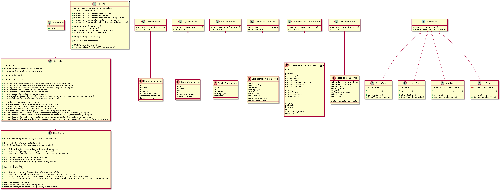
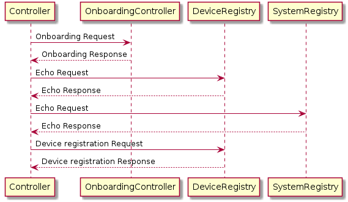

# client-adapter-app-qt
# QArrowheadClientAdapterApp
## Developer manual
### Classes
The Class Diagram of the application is presented in Figure 6:


*Figure 6 - QArrowheadClientAdapterApp Class Diagram*

#### Main classes
##### ConsoleApp
The class **ConsoleApp** reads the commands from the standard input, validates them, calls the corresponding functions of class Controller and shows help for each command .
###### Responsibilites:
- Reading user input
- Validating commands
- Making the proper calls to Controller
- Showing data returned from Controller
- Showing help for the commands
##### Controller
The class **Controller** provides an interface for using the Arrowhead Framework core systems using the *QArrowheadClientSystemAdapter* and *QArrowheadClientDeviceAdapter* libraries.
###### Responsibilites:
- Providing interface for
  - registering/unregistering devices/systems/services
  - orchestrating systems
  - setting user preferences
  - getting information about previously registered devices/systems/services, system orchestrations and preferences
- Managing the whole onboarding process including using the proper certificates for each call
###### Main fuctions:
- ```void selectDevice(const std::string& name)```: Selects a previously registered device (sets the context to it).
- ```void selectSystem(const std::string& name, const std::string& on = "")```: Selects a previously registered system (sets the context to it).
- ```std::string getContext()```: Returns the actual context string.
- ```void registerDevice(const Record<DeviceParam>& deviceToRegister, const std::string& on = "")```: Onboards and registers a device on the Arrowhead Local Cloud and saves its data in the filesystem.

*Figure 7 - QArrowheadClientAdapterApp Sequence Diagram for registerDevice*
- ```void registerSystem(const Record<SystemParam>& systemToRegister, const std::string& on = "")```: Onboards and  registers a system on the Arrowhead Local Cloud and saves its data in the filesystem.
- ```void registerService(const Record<ServiceParam>& serviceToRegister, const std::string& on = "")```: Registers a service on the Arrowhead Local Cloud and saves its data in the filesystem.
- ```void unregisterDevice(const std::string& name)```: Unregisters a device on the Arrowhead Local Cloud and removes its data from the filesystem.
- ```void unregisterSystem(const std::string& name, const std::string& on = "")```: Unregisters a system on the Arrowhead Local Cloud and removes its data from the filesystem.
- ```void unregisterService(const std::string name, const std::string& on = "")```: Unregisters a service on the Arrowhead Local Cloud and removes its data from the filesystem.
- ```void orchestrateSystem(const Record<OrchestrationRequestParam>& orchestrationRequest, const std::string& on = "")```: Requests orchestration for a system using the given data and saves its data in the filesystem.
- ```void setSettings(const Record<SettingsParam>& settings_param)```: Sets user preferences.
- ```Record<DeviceParam> getDevice(const std::string& name)```: Returns the data of a previously registered device with the given name.
- ```Record<SystemParam> getSystem(const std::string& name, const std::string& on = "")```: Returns the data of a previously registered system with the given name.
- ```Record<ServiceParam> getService(const std::string& name, const std::string& on = "")```: Returns the data of a previously registered service with the given name.
- ```Record<OrchestrationParam> getOrchestration(const std::string& name="", std::string on = "")```: Returns the data of a previously requested orchestration with the given name.
- ```std::vector<Record<DeviceParam>> getDevices(const std::string& filter="", const std::vector<DeviceParam>& parameters = {})```: Returns the requested parameters of previously registered devices with a name that mathches the given regex filter.
- ```std::vector<Record<SystemParam>> getSystems(const std::string& filter="", const std::vector<SystemParam>& parameters = {}, const std::string& on = "")```: Returns the requested parameters of previously registered systems with a name that mathches the given regex filter.
- ```std::vector<Record<ServiceParam>> getServices(const std::string& filter="", const std::vector<ServiceParam>& parameters = {}, const std::string& on = "")```: Returns the requested parameters of previously registered services with a name that mathches the given regex filter.
- ```std::vector<Record<OrchestrationParam>> getOrchestrations(const std::string& filter="", const std::vector<std::string>& parameters = {}, const std::string& on = "")```: Returns the requested parameters of previously requested orchestrations with a name that mathches the given regex filter.
##### DataStore
The class **DataStore** is used to save app data in the filesystem and read it back.
###### Responsibilites:
- Providing interface for
  - saving/loading/removing devices/systems/services/
  - saving/loading orchestrations/settings
  - checking if saved data for a given device/system/service exists
  - saving/loading onboarding/device/system certificates
  - loading private/public keys from the path specified in settings
- Saving/reading data on the disk
##### Record<T>
The class **Record<T>** is used to store data in a key-value format, serialize and deserialize it, where key is a template parameter and value is of **ValueType**.
###### Responsibilites:
- Storing keys and values and providing access to them as their value types (the value type must be known) or as strings
- Providing functions to remove/project fields
- Providing functions to serialize/deserialize the object

#### Enumerators
The enumerator classes (**DeviceParam**, **SystemParam**, **ServiceParam**, **OrchestartionParam**, **OrchestrationRequestParam**, **SettingsParam**) are used as template parameters for **Record<T>** to represent the parameters of a device/system/service/orchestration/orchestraion request/settings data structure.
###### Responsibilites: 
- Storing a parameter
- Providing functions for *parameter to string* conversion and vice versa

#### Types
The type classes (**StringType**, **IntegerType**, **MapType**, **ListType**) are inherited from abstract class **ValueType** and used for storing values of different types.
###### Responsibilites:
- Storing a value and providing access to it
- Providing functions for converting value to string/json value.

